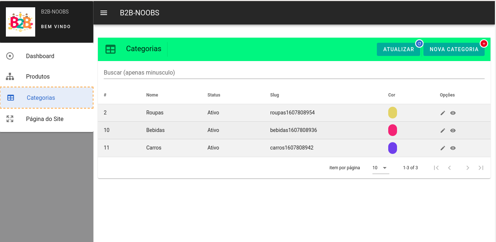
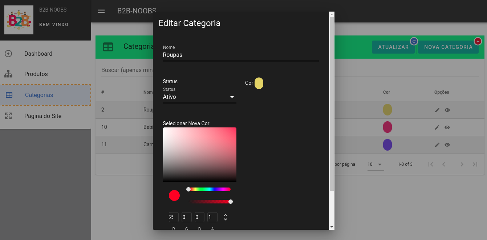

# nuxt-fy-crud-laravel-api

#### Tecnologias:

Nuxt e Vuetify (front)
Laravel Api (back)

#### Objetivo:

Um Painel Administrativo com Cadastro, Edição, Exclusão e Listagem
de Produtos e Categorias e
Página Inicial que mostra os Produtos com Imagens

---

##### Print das telas do projeto

<p align="center">
</p>

<p align="center">
</p>

<p align="center">
</p>

<p align="center">
</p>

<p align="center">
</p>

### Requisitos:

+ composer

+ npm 

+ php >= 7.3

+ mysql ou mariab

+ apache ou nginx

#### Configurando o Backend:

+ Abra a pasta back 

```bash
composer install
```

```bash
cp .env.example .env
```
+ Configure as variaveis de Banco de dados no arquivo .env para configuração das tabelas (configure um Banco para fins de teste)

```bash
php artisan key:generate
```

```bash
php artisan migrate:fresh --seed
```

```bash
php artisan serve
```

+ Deixe o servidor rodando

2. Execute os comandos a seguir para as configurações de frontend:

#### Configurando o Frontend:

##### instale a aplicação do front

```
docker-compose up -d
```

##### entre na aplicação do front

```
docker exec -it nuxt-fy-crud-laravel-api bash
```

##### instale a dependencias

```
npm install
```

##### compile a aplicação
```
npm run build
```

##### Crie um arquivo .env a partir de .env.example
```
coloqe a url da api (url do servidor do laravel) em URL_API
digite o nome do projeto em PROJECT_NAME
```

##### Compile e Rode 
```
npm run dev

ou

npm run build (para producao)
```

##### Caso tenha problemas com instalação do projeto envie um email para:
```
lucianopalharesrosa@hotmail.com
```

